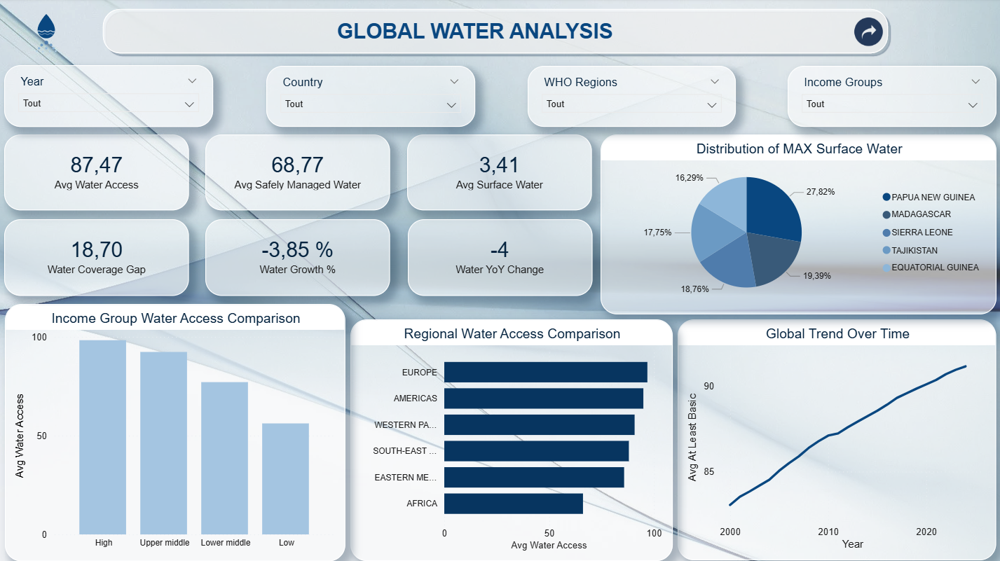
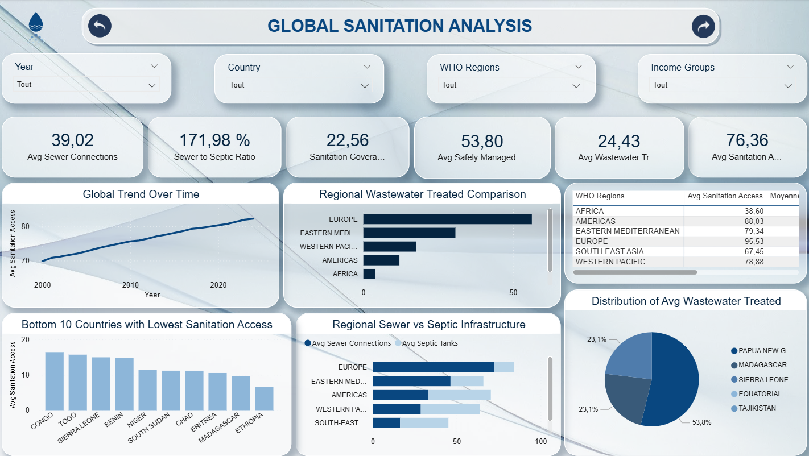
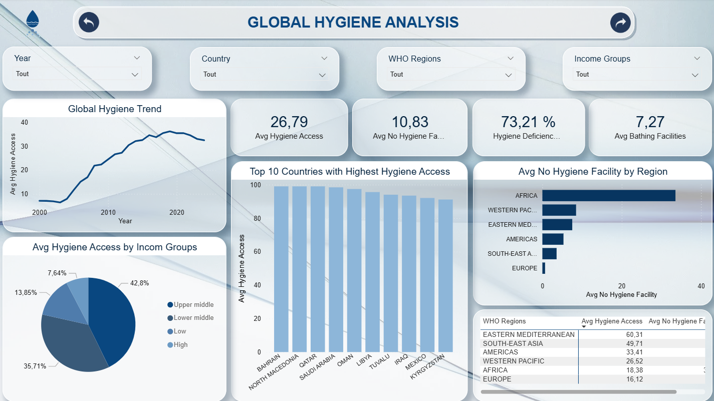
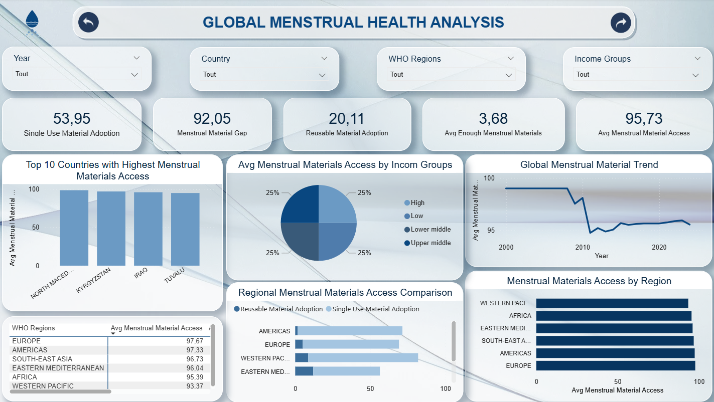
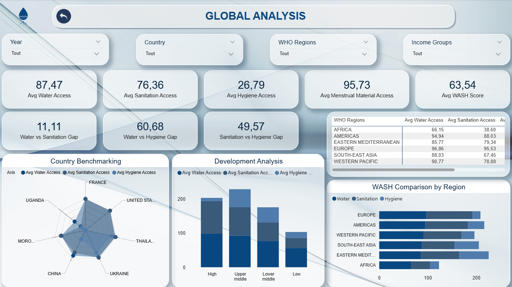

# Global Water, Sanitation & Hygiene (WASH) Analysis

## Project Overview

This project focuses on the analysis of global Water, Sanitation, Hygiene, and Menstrual Health indicators using official WHO/UNICEF JMP datasets. The goal is to explore worldwide disparities in access to essential WASH services and transform raw public health data into actionable analytical insights through Python and Power BI.

The project covers the complete data analysis workflow:

- Data cleaning and preprocessing using Python
- Exploratory Data Analysis (EDA)
- Comparative and regional analysis
- KPI and metric creation
- Interactive dashboard development in Power BI

The final dashboard enables users to analyze WASH indicators across countries, regions, years, and income groups while highlighting global inequalities and development gaps.

---

## Objectives

- Analyze global access to drinking water, sanitation, hygiene, and menstrual health services
- Identify disparities between countries, WHO regions, and income groups
- Compare WASH indicators across multiple dimensions and years
- Explore relationships between urbanization and WASH accessibility
- Build an interactive Power BI dashboard for data-driven exploration
- Transform complex public datasets into clear and meaningful visual insights

---

## Dataset Information

The project uses a global WASH (Water, Sanitation, and Hygiene) dataset collected from international public health and development sources.

The original dataset is stored in:

```bash
data/data.xlsx
```

The Excel file contains  **4 sheets** , each representing a different domain of WASH indicators:

* Water
* Sanitation
* Hygiene
* Menstrual Health

The datasets contain yearly country-level indicators related to access to basic services, infrastructure, hygiene conditions, and public health metrics.

### 🌍 Water Dataset

This sheet contains indicators related to drinking water access and water service quality across countries.

#### Main Columns

| Column                                  | Description                                            |
| --------------------------------------- | ------------------------------------------------------ |
| COUNTRY, AREA OR TERRITORY              | Country name                                           |
| Year                                    | Observation year                                       |
| Population (thousands)                  | Total population                                       |
| % urban                                 | Percentage of urban population                         |
| At least basic                          | Population with at least basic drinking water services |
| Limited (more than 30 mins)             | Limited water access requiring more than 30 minutes    |
| Unimproved                              | Population using unimproved water sources              |
| Surface water                           | Population relying on surface water                    |
| Annual rate of change in at least basic | Yearly improvement rate                                |
| Safely managed                          | Population with safely managed drinking water          |
| Accessible on premises                  | Water available at home                                |
| Available when needed                   | Reliability of water service                           |
| Free from contamination                 | Water quality indicator                                |
| Piped                                   | Population using piped water                           |
| Non-piped                               | Population using non-piped services                    |
| ISO3                                    | ISO country code                                       |
| SDG Region                              | Sustainable Development Goal region                    |
| UNICEF Programme regions                | UNICEF regional classification                         |
| WHO regions                             | WHO regional classification                            |
| Income Groupings                        | Country income classification                          |

### 🚽 Sanitation Dataset

This sheet focuses on sanitation services, wastewater treatment, and sanitation infrastructure.

#### Main Columns

| Column                                   | Description                               |
| ---------------------------------------- | ----------------------------------------- |
| COUNTRY, AREA OR TERRITORY               | Country name                              |
| Year                                     | Observation year                          |
| Population (thousands)                   | Total population                          |
| % urban                                  | Percentage of urban population            |
| At least basic                           | Population with at least basic sanitation |
| Limited (shared)                         | Shared sanitation facilities              |
| Unimproved                               | Population using unimproved sanitation    |
| Open defecation                          | Population practicing open defecation     |
| Annual rate of change in at least basic  | Annual sanitation improvement             |
| Annual rate of change in open defecation | Evolution of open defecation              |
| Safely managed                           | Safely managed sanitation services        |
| Disposed in situ                         | Waste disposed on-site                    |
| Emptied and treated                      | Wastewater emptied and treated            |
| Wastewater treated                       | Percentage of treated wastewater          |
| Latrines and other                       | Alternative sanitation systems            |
| Septic tanks                             | Population connected to septic systems    |
| Sewer connections                        | Population connected to sewer systems     |
| ISO3                                     | ISO country code                          |
| WHO regions                              | WHO regional classification               |
| Income Groupings                         | Country income classification             |

### 🧼 Hygiene Dataset

This sheet includes indicators related to hygiene access and household hygiene conditions.

#### Main Columns

| Column                                    | Description                                       |
| ----------------------------------------- | ------------------------------------------------- |
| COUNTRY, AREA OR TERRITORY                | Country name                                      |
| Year                                      | Observation year                                  |
| Population (thousands)                    | Total population                                  |
| % urban                                   | Percentage of urban population                    |
| Basic                                     | Population with basic hygiene services            |
| Limited (without water or soap)           | Limited hygiene access                            |
| No facility                               | Population without hygiene facilities             |
| Annual rate of change in at least basic   | Hygiene improvement rate                          |
| Bathing facilities on premises with water | Households with water-equipped bathing facilities |
| Bathing facilities on premises            | Households with bathing facilities                |
| ISO3                                      | ISO country code                                  |
| WHO regions                               | WHO regional classification                       |
| Income Groupings                          | Country income classification                     |

### ♀️ Menstrual Health Dataset

This sheet contains indicators related to menstrual hygiene and women’s health accessibility.

#### Main Columns

| Column                                                               | Description                            |
| -------------------------------------------------------------------- | -------------------------------------- |
| COUNTRY, AREA OR TERRITORY                                           | Country name                           |
| Year                                                                 | Observation year                       |
| Female population age 15-49 (thousands)                              | Female population in reproductive age  |
| % urban                                                              | Percentage of urban population         |
| Awareness of menstruation before menarche                            | Menstrual education indicator          |
| Private place to wash and change                                     | Access to private hygiene spaces       |
| Participation in school, work, social activities during menstruation | Social participation indicator         |
| Use of menstrual materials                                           | Usage of menstrual hygiene materials   |
| Reusable materials                                                   | Usage of reusable menstrual products   |
| Use of single-use materials                                          | Usage of disposable menstrual products |
| Enough menstrual materials                                           | Access sufficiency indicator           |
| Ability to reduce menstruation-related pain                          | Health and pain management indicator   |
| Comfort seeking help from a health care provider                     | Healthcare accessibility indicator     |
| ISO3                                                                 | ISO country code                       |
| WHO regions                                                          | WHO regional classification            |
| Income Groupings                                                     | Country income classification          |

### 🛠️ Cleaned Datasets

After preprocessing and cleaning in Python, the datasets were exported as independent CSV files for Power BI analysis:

```bash
powerbi/data/water_data_clean.csv
powerbi/data/sanitation_data_clean.csv
powerbi/data/hygiene_data_clean.csv
powerbi/data/menstrual_health_data_clean.csv
```

The cleaning process included:

* Renaming columns
* Removing unnecessary metadata
* Handling missing values
* Standardizing column names
* Converting numeric fields
* Preparing datasets for visualization and KPI analysis

## Tech Stack

The project combines data analysis, data cleaning, visualization, and business intelligence tools to build an end-to-end analytical workflow.

### 🐍 Programming & Data Analysis

| Tool / Library   | Purpose                         |
| ---------------- | ------------------------------- |
| Python           | Data preprocessing and analysis |
| Pandas           | Data cleaning and manipulation  |
| NumPy            | Numerical operations            |
| Matplotlib       | Data visualization              |
| Jupyter Notebook | Exploratory Data Analysis (EDA) |

### 📊 Business Intelligence & Visualization

| Tool        | Purpose                             |
| ----------- | ----------------------------------- |
| Power BI    | Interactive dashboard creation      |
| DAX         | KPI calculations and measures       |
| Power Query | Data transformation inside Power BI |

### 🗄️ Data Storage & Formats

| Technology    | Purpose                                       |
| ------------- | --------------------------------------------- |
| Excel (.xlsx) | Original data source                          |
| CSV           | Cleaned datasets for Power BI                 |
| GitHub        | Project version control and portfolio hosting |

### 🛠️ Development Environment

| Tool     | Purpose                       |
| -------- | ----------------------------- |
| VS Code  | Development environment       |
| Anaconda | Python environment management |
| Git      | Version control               |

---

## Project Workflow

The project followed a complete end-to-end data analytics workflow:

1. Data Collection
2. Data Cleaning & Preprocessing
3. Exploratory Data Analysis (EDA)
4. Data Export & Transformation
5. Power BI Data Modeling
6. Dashboard Development
7. KPI & DAX Measure Creation
8. Insight Generation & Storytelling
9. GitHub Documentation & Publishing

The workflow combines Python for data preprocessing and Power BI for business intelligence and dashboard visualization.

### 📥 1. Data Collection

- Imported the original Excel dataset containing:

  - Water data
  - Sanitation data
  - Hygiene data
  - Menstrual health data
- Loaded multiple sheets using Python and Pandas.

### 🧹 2. Data Cleaning & Preprocessing

Performed several preprocessing operations on each dataset:

- Renamed columns for consistency
- Removed unnecessary metadata columns
- Handled missing values
- Converted numeric columns
- Standardized country names
- Cleaned formatting inconsistencies
- Exported cleaned datasets into CSV files

#### Output Files

```bash
water_data_clean.csv
sanitation_data_clean.csv
hygiene_data_clean.csv
menstrual_health_data_clean.csv
```

### 🔍 3. Exploratory Data Analysis (EDA)

Conducted exploratory analysis to better understand global WASH trends.

#### Analysis Performed

* Country-level comparisons
* Regional analysis by WHO regions
* Distribution analysis
* Trend analysis over time
* Top and bottom performing countries
* Gap analysis between countries and income groups
* Multi-dataset comparisons:
* Water vs Sanitation vs Hygiene

#### Visualizations Created

* Line charts
* Histograms
* Bar charts
* Grouped bar charts
* Comparative visualizations

### 📊 4. Power BI Dashboard Development

Built an interactive multi-page dashboard to visualize key global WASH indicators.

#### Dashboard Pages

| Page                          | Description                                      |
| ----------------------------- | ------------------------------------------------ |
| Water Analysis                | Drinking water access indicators                 |
| Sanitation Analysis           | Sanitation infrastructure and wastewater metrics |
| Hygiene Analysis              | Hygiene access and facilities                    |
| Menstrual Health Analysis     | Menstrual hygiene accessibility indicators       |
| Global / Comparative Analysis | Cross-domain comparisons and global insights     |

#### KPI & DAX Measures

Created custom DAX measures for advanced analytics and dashboard interactivity.

##### Examples

* Average access rates
* Growth metrics
* Year-over-year evolution
* Global averages
* Country rankings
* Comparative indicators

#### Data Modeling

Created a star-schema-inspired model in Power BI using:

##### Dimension Tables

* `YEAR`
* `COUNTRY`

##### Fact Tables

* Water dataset
* Sanitation dataset
* Hygiene dataset
* Menstrual health dataset

Relationships were created using:

* `country`
* `year`

The Power BI dashboard was designed to provide an interactive and comparative analysis of global WASH (Water, Sanitation, and Hygiene) indicators.

The dashboard includes filters for:

- Year
- Country
- WHO Regions
- Income Groups

It also contains KPIs, trend analysis, regional comparisons, and global inequality insights.

#### 🌍 Global Water Analysis Dashboard

This dashboard focuses on global drinking water accessibility and water service quality indicators.

##### Main Features

- Average water access KPIs
- Safely managed water analysis
- Water coverage gap metrics
- Regional comparison by WHO regions
- Income group comparison
- Global trend evolution over time
- Surface water distribution analysis



#### 🚽 Global Sanitation Analysis Dashboard

This dashboard explores sanitation infrastructure and wastewater treatment accessibility worldwide.

##### Main Features

- Sanitation access KPIs
- Sewer vs septic infrastructure comparison
- Wastewater treatment analysis
- Regional sanitation comparison
- Global sanitation trend over time
- Bottom 10 countries with lowest sanitation access
- WHO regional comparison tables



#### 🧼 Global Hygiene Analysis Dashboard

This dashboard examines hygiene facility access and deficiency patterns globally, with breakdowns by region and income group.

##### Main Features

* Hygiene access KPIs (Avg Hygiene Access, Avg No Hygiene Facility, Hygiene Deficiency Rate, Avg Bathing Facilities)
* Global hygiene trend over time
* Hygiene access by income group (pie chart)
* Top 10 countries with highest hygiene access
* Average no-hygiene facility rate by WHO region
* WHO regional comparison table



#### 🩸 Global Menstrual Health Analysis Dashboard

This dashboard focuses on menstrual health access and material availability across countries, regions, and income levels worldwide.

##### Main Features

* Menstrual health KPIs (Single Use Adoption, Material Gap, Reusable Adoption, Enough Materials, Avg Access)
* Top 10 countries with highest menstrual materials access
* Menstrual material access by income group (pie chart)
* Regional comparison of reusable vs single-use material adoption
* Global menstrual material access trend over time
* Menstrual materials access by WHO region
* WHO regional comparison table



#### 🌍 Global Analysis Dashboard

This dashboard provides a comprehensive overview of global WASH (Water, Sanitation, and Hygiene) indicators across countries, regions, and income groups.

##### Main Features

* Key WASH KPIs (Water Access, Sanitation Access, Hygiene Access, Menstrual Material Access, WASH Score)
* Water vs Sanitation, Water vs Hygiene, and Sanitation vs Hygiene gap metrics
* Country benchmarking radar chart
* Development analysis by income group
* WASH comparison by WHO region
* WHO regional breakdown table



---

## Version Control & Publishing

The entire project was versioned and published on GitHub, including:

* Python notebooks
* Cleaned datasets
* Power BI dashboard
* README documentation
* Dashboard screenshots

This ensures reproducibility, portfolio presentation, and project scalability.

---

## Key Insights

- Global access to basic water and sanitation services has significantly improved over time, especially in high-income regions.
- Strong disparities still exist between developed and developing countries, particularly in sanitation and hygiene accessibility.
- Europe and the Americas consistently show the highest WASH coverage rates, while several African regions remain below global averages.
- Sanitation access generally lags behind drinking water access worldwide, highlighting persistent infrastructure challenges.
- Hygiene and menstrual health indicators reveal major inequalities linked to income levels and urbanization.
- Countries with higher urbanization rates tend to have better access to safely managed water and sanitation services.
- Wastewater treatment infrastructure remains highly uneven across regions, with low-income countries facing major limitations.
- The dashboard highlights how data visualization can support public health monitoring and sustainable development decision-making.

---

## Project Structure

```bash
water-sanitation-analysis-world/
│
├── data/
│   └── data.xlsx
│
├── notebook/
│   └── data_cleaning.ipynb
│
├── powerbi/
│   ├── WASH_analysis_dashboard.pbix
│   ├── aquaflow_icon_transparent.svg
│   ├── arrow_vers.png
│   ├── arrow.png
│   ├── pbi_theme_wash.json
│   └── data/
│       ├── water_data_clean.csv
│       ├── sanitation_data_clean.csv
│       ├── hygiene_data_clean.csv
│       └── menstrual_health_data_clean.csv
│
├── images/
│   ├── global_water_analysis_dashboard.png
│   ├── global_sanitation_analysis_dashboard.png
│   ├── global_hygiene_analysis_dashboard.png
│   ├── global_menstrual_materials_analysis_dashboard.png
│   └── global_global_analysis_dashboard.png
│
└── README.md
```

---

## How to Run the Project

### 1️⃣ Clone the Repository

```
git clone https://github.com/Nimat13/water-sanitation-world-analysis.git
```

### 2️⃣ Open the Project

Open the project folder in:

* VS Code
* Jupyter Notebook
* Anaconda

### 3️⃣ Install Required Libraries

```
pip install -r requirements.txt
```

Or install manually:

```
pip install pandas numpy matplotlib openpyxl
```

### 4️⃣ Run the Notebook

Launch the notebook located in:

```
notebooks/wash_analysis.ipynb
```

The notebook includes:

* Data loading
* Data cleaning
* EDA
* Visualization
* CSV export for Power BI

### 5️⃣ Open the Power BI Dashboard

Open the Power BI file:

```
powerbi/WASH_analysis_dashboard.pbix
```

Then refresh the data sources if necessary.

---

## Future Improvements

* Add more advanced statistical analysis
* Integrate additional public health datasets
* Include predictive analytics and forecasting
* Deploy the dashboard online using Power BI Service
* Add geographic map visualizations
* Automate data updates using APIs
* Expand comparative analysis between countries and regions
* Create AI-powered insight generation features

---

## Author

### 👤 Nimat Allah KHALDOUNE

Data Analyst passionate about:

* Business Intelligence
* Data Visualization
* AI-powered Analytics
* Power BI & Python
* Data Storytelling

### 📫 Contact

* GitHub: [Nimat13](https://github.com/Nimat13)
* LinkedIn: https://linkedin.com/in/nimat-allah-khaldoune-905559325
